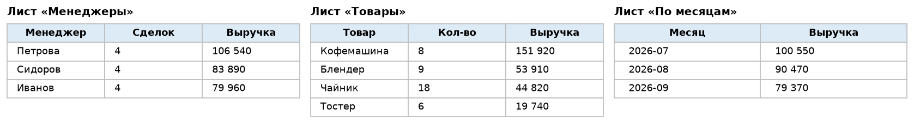
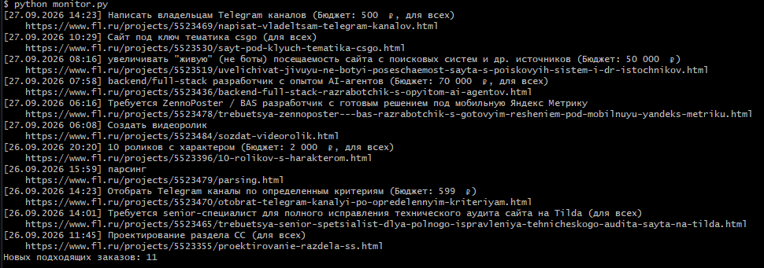

# Python-автоматизация: парсеры, Excel-отчёты, Telegram-боты

Делаю небольшие скрипты, которые экономят часы ручной работы.
Ниже примеры: каждый проект запускается одной командой, код с комментариями.

**Связаться:** Telegram [@Coffee_2code](https://t.me/Coffee_2code) · coffee2code@mail.ru

## Проекты

| Проект | Задача клиента | Стек |
|---|---|---|
| [Парсер каталога](price_parser/) | Собрать товары и цены с сайта в Excel | requests, BeautifulSoup, openpyxl |
| [Автоотчёт по продажам](excel_report/) | Сделать сводный отчёт из «сырой» таблицы за секунды | pandas, openpyxl |
| [Бот для заявок](tg_bot/) | Принимать заявки клиентов в Telegram 24/7 | aiogram 3 |
| [Монитор заказов FL.ru и Хабр](orders_monitor/) | Первым узнавать о новых заказах по нужной теме | RSS, requests, Telegram API |

Пример готового отчёта: [`excel_report/example_report.xlsx`](excel_report/example_report.xlsx).



Монитор заказов на живой ленте FL.ru:



## Что могу сделать для вас

- парсинг сайтов → CSV / Excel / Google-таблица
- обработка, очистка и объединение Excel/CSV-файлов, автоотчёты
- Telegram-боты: заявки, запись, FAQ, рассылка
- небольшие скрипты автоматизации рутины

## Установка

Нужен Python 3.10+.

```bash
pip install -r requirements.txt
pytest   # проверить, что всё работает
```

## Связаться

- Telegram: [@Coffee_2code](https://t.me/Coffee_2code)
- Почта: coffee2code@mail.ru

Опишите задачу в паре предложений — отвечу в течение дня: реально ли сделать, сколько займёт и сколько будет стоить.
