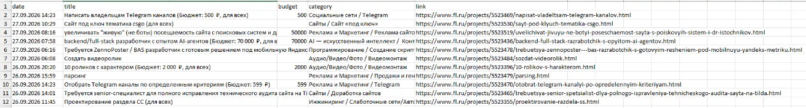

# Монитор заказов с FL.ru и Хабр Фриланс

Следит за новыми проектами на FL.ru и Хабр Фриланс и присылает только те,
что подходят по словам: python, парсер, бот, excel и т.д.
Пользуюсь сам, чтобы первым откликаться на свежие заказы.

## Как работает

- берёт официальные RSS-ленты бирж, поэтому не ломается от смены вёрстки
- если одна биржа недоступна, остальные продолжают работать
- фильтрует по ключевым словам в названии, описании и категории
- вытаскивает бюджет из текста («Бюджет: 3 000 ₽» → `3000`)
- запоминает уже виденные заказы (`seen.json`) и показывает только новые
- сохраняет всё в `orders.xlsx` и, если нужно, шлёт в Telegram

## Как выглядит

Запуск на живой ленте FL.ru:


То же в `orders.xlsx`:



## Запуск

```bash
pip install -r ../requirements.txt
python monitor.py                          # проверить один раз
python monitor.py --watch 10               # проверять каждые 10 минут
python monitor.py --keywords "django,api"  # свои слова
```

Чтобы заказы приходили в Telegram, создайте бота у @BotFather и положите
рядом со скриптом файл `.env` (он не попадает в git):

```
BOT_TOKEN=токен от @BotFather
ADMIN_ID=ваш числовой id от @userinfobot
```

```bash
python monitor.py --watch 10 --telegram
```

Биржи настраиваются в словаре `FEEDS` в начале `monitor.py`.

Тесты: `pytest`
